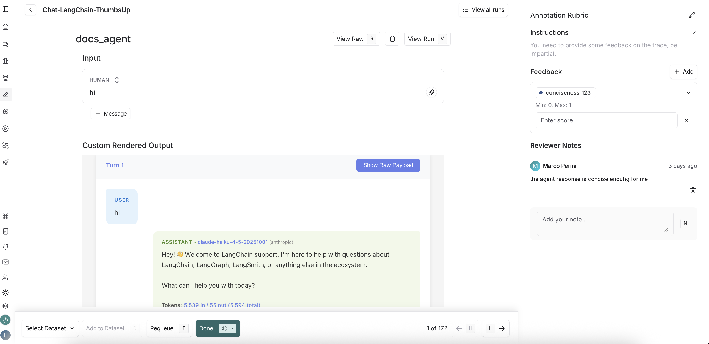
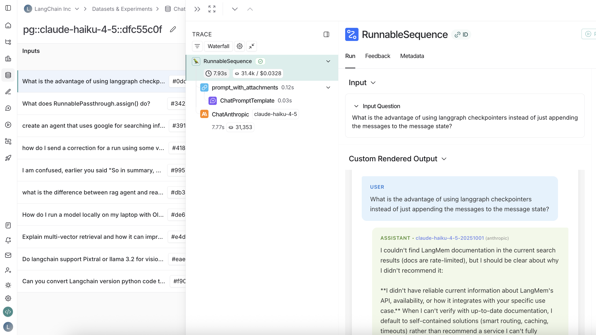

# LangSmith Custom Output Rendering

This project demonstrates how to create custom output renderers for LangSmith annotation queues and datasets. It provides a React-based UI that receives data from LangSmith via the `postMessage` API and displays it in a customizable format.

## Screenshots

### Annotation Queue View



The renderer displays conversation turns in a clean, chat-like interface with model information, token usage, and metadata for easy annotation.

### Dataset View



The dataset endpoint supports both regular outputs and reference outputs, displaying them in the same conversation format for easy comparison.

## Features

- **Multi-turn Conversation View**: Automatically parses and displays messages as conversation turns (human + AI pairs)
- **Model Information**: Shows model name, provider, and token usage for each AI response
- **Token Usage Display**: Detailed token metrics including input/output/total tokens and cache statistics
- **Raw Payload Inspector**: Toggle to view the complete raw payload structure for debugging
- **Annotation-Friendly UI**: Clean, chat-like interface optimized for reviewers to annotate threads
- **Real-time Updates**: Automatically displays new messages as they arrive from LangSmith

## Setup

### Prerequisites

- Node.js 18+ and npm/yarn
- ngrok (for exposing the local server)

### Installation

1. Install dependencies:

```bash
npm install
```

2. Start the development server:

```bash
npm run dev
```

The server will start on `http://localhost:8000`.

### Exposing with Ngrok

1. Install ngrok (if not already installed):

```bash
# macOS
brew install ngrok

# Or download from https://ngrok.com/download
```

2. In a separate terminal, expose your local server:

```bash
ngrok http 8000
```

3. Copy the public URL provided by ngrok (e.g., `https://abc123.ngrok-free.app`)

## Endpoints

This project provides two separate endpoints for different use cases:

- **`/annotation-queue`** - For annotation queues in LangSmith
- **`/dataset`** - For datasets (supports both output and reference outputs)

The root path (`/`) displays a selector page to choose between endpoints.

## Configuration in LangSmith

### For Annotation Queues

1. Navigate to the **Annotation Queues** page in LangSmith
2. Click on an existing annotation queue or create a new one
3. In the annotation queue settings pane, scroll to the **Custom Output Rendering** section
4. Toggle **Enable custom output rendering**
5. Enter your ngrok URL with the `/annotation-queue` path:
   ```
   https://abc123.ngrok-free.app/annotation-queue
   ```
6. Click **Save** or **Create**

**Example**: If your ngrok URL is `https://abc123.ngrok-free.app`, use `https://abc123.ngrok-free.app/annotation-queue`

### For Datasets

1. Navigate to your dataset in the **Datasets & Experiments** page
2. Click **⋮** (three-dot menu) in the top right corner
3. Select **Custom Output Rendering**
4. Toggle **Enable custom output rendering**
5. Enter your ngrok URL with the `/dataset` path:
   ```
   https://abc123.ngrok-free.app/dataset
   ```
6. Click **Save**

**Example**: If your ngrok URL is `https://abc123.ngrok-free.app`, use `https://abc123.ngrok-free.app/dataset`

**Note**: The dataset endpoint supports both `"output"` and `"reference"` message types. Reference outputs are clearly labeled in the UI.

## Understanding the Payload

LangSmith sends messages via the `postMessage` API with the following structure:

```typescript
{
  type: "output" | "reference",
  data: {
    // The outputs (actual output or reference output)
    // Structure varies based on your application
  },
  metadata: {
    inputs: {
      // The inputs that generated this output
      // Structure varies based on your application
    }
  }
}
```

- `type`: Indicates whether this is an actual output (`"output"`) or a reference output (`"reference"`)
- `data`: The output data itself
- `metadata.inputs`: The input data that generated this output, provided for context

## Message Delivery

LangSmith uses an exponential backoff retry mechanism to ensure your page receives the data even if it loads slowly. Messages are sent up to 6 times with increasing delays (100ms, 200ms, 400ms, 800ms, 1600ms, 3200ms).

## Development

### Project Structure

```
.
├── pages/
│   ├── _app.js              # Next.js app wrapper
│   ├── index.js             # Landing page with endpoint selector
│   ├── annotation-queue.js  # Annotation queue endpoint
│   └── dataset.js           # Dataset endpoint
├── components/
│   └── ConversationTurn.js  # Reusable conversation turn component
├── utils/
│   └── conversation.js      # Conversation parsing utilities
├── styles/
│   ├── globals.css           # Global styles
│   └── App.module.css       # Component styles (CSS Modules)
├── next.config.js           # Next.js configuration
└── package.json             # Dependencies
```

### Building for Production

```bash
npm run build
npm start
```

The built files will be in the `.next` directory.

## Example Output

The renderer automatically parses LangSmith messages and displays them as conversation turns. Each turn shows:

- **User messages** (left-aligned, blue background)
- **AI assistant messages** (right-aligned, green background) with:
  - Model name and provider
  - Token usage (input/output/total)
  - Cache statistics (if available)
  - Stop reason
  - Tool calls count (if any)
- **Raw payload toggle** to view the complete JSON structure

This makes it easy for reviewers to understand the conversation flow and annotate threads effectively.

## Usage Examples

### Annotation Queue Example

When configuring an annotation queue, use:
```
https://your-ngrok-url.ngrok-free.app/annotation-queue
```

This endpoint is optimized for annotation workflows and displays conversation turns with all relevant metadata for reviewers.

### Dataset Example

When configuring a dataset, use:
```
https://your-ngrok-url.ngrok-free.app/dataset
```

This endpoint supports both:
- **Output messages**: Actual run outputs from your application
- **Reference messages**: Expected/reference outputs for comparison

The UI clearly indicates when viewing a reference output vs. an actual output.

## License

MIT
